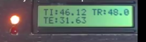

# Projeto 1 - 2021/1
 
## [Link](https://gitlab.com/fse_fga/projetos_2021_1/projeto-1-2021-1) do Enunciado 

## Objetivo

Este trabalho tem por objetivo a implementação do software de uma bancada para testes de controle de temperatura de um sistema que possui internamente dois dispositivos para alterar sua temperatura. O primeiro é um resistor de potência de 15 Watts utilizado para aumentar temperatura e o segundo, uma ventoinha que puxa o ar externo (temperatura ambiente) para reduzir a temperatura do sistema. O controle pode ser feito pelas estratégias PID ou ON/OFF e a temperatura de referência pode ser definida pelo usuário ou por um potenciômetro integrante do sistema.

## Compilação

Para compilar, vá até o diretório do projeto e digite o seguinte comando:

`$ make`

## Execução

Em seguida, digite o comando abaixo:

`$ make run` 

## Utilização

Ao executar o programa, os valores das temperaturas medidas serão exibidos a cada 1 segundo no terminal e no LCD. Caso o controle seja definido pela chave, o estado também será mostrado no terminal a cada 1 segundo como "Switch status".

- TI - Temperatura Interna 
- TE - Temperatura Externa (Ambiente) 
- TR - Temperatura de Referência (Definida pelo potenciômetro ou pelo usuário)

Também existe um menu que permite que o usuário escolha o modo de controle manualmente ou pela chave, onde os estados 0 e 1 representam os controles ON/OFF e PID respectivamente. No caso do modo de controle ON/OFF o usuário também pode definir a histerese (diferença entre o limite superior e o inferior da variação de temperatura ) do sistema. Além disso, o menu permite que o usuário defina a temperatura de referência ou escolha usar a temperatura do potenciômetro.

### Exemplo

#### Terminal

#### LCD

## Gráficos

Os testes foram feitos durante 10 minutos cada, usando as duas estratégias de controle (ON/OFF e PID) e a temperatura de referência definida pelo potenciômetro.

O sinal de controle varia entre -100 e 100, onde:

- 0 = Tudo desligado
- 100 = Resistor na potência máxima
- -100 = Ventoinha na potência máxima

### Teste usando o controle ON/OFF

Temperatura de Referência medida pelo Potenciômetro e Histerese definida em 4°C.

#### Temperaturas

#### Sinal de Controle

### Teste usando o controle PID 

Temperatura de Referência medida pelo Potenciômetro

#### Temperaturas

#### Sinal de Controle

